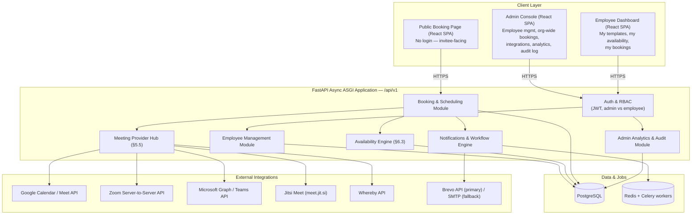

# Kavach Connect — Meeting Scheduling & Availability Management Platform
### Product Requirements Document & Agent Build Brief

**Prepared for:** Kavach Infra Solutions LLP — Hyperbuild Live Industry Project (Lexicon MILE)
**Prepared by:** Prachi Goenka
**Build environment:** Google Antigravity (local, agentic IDE) + Aiven for PostgreSQL (managed, cloud-hosted database)
**Document type:** Self-contained build brief — an Antigravity agent should be able to read this document alone and begin scaffolding the project without further clarification.

> **Product name:** *Kavach Connect*. Every reference below has been updated to this name; the repo folder, package names, and slugs use the kebab-case form `kavach-connect`.

---

## 1. Executive Summary

Kavach Connect is a full-stack clone of Calendly's core scheduling engine, purpose-built for an organization (Kavach Infra Solutions LLP) rather than for independent solo users: an **admin provisions employee accounts**, each **employee independently defines their own bookable meeting templates and working-hours availability**, and each employee's public booking link lets outside invitees book a slot with them without any back-and-forth. The **admin retains full visibility** across every employee's templates, availability, and bookings from a single console, and centrally configures which video-conferencing platforms (Google Meet, Zoom, Microsoft Teams, Jitsi, Whereby) are available for employees to attach to their meetings.

It is being built as a live industry project for Kavach Infra Solutions LLP, based on the brief *"Hyperbuild Tool Development – Live Industry Project"* (Kavach Infra Solutions LLP, WFH, stipend ₹10,000), whose stated objective is:

> *"Develop a Meeting Scheduling & Availability Management Tool that allows users to easily identify available and occupied meeting slots before scheduling a meeting."*

This PRD goes beyond that brief's minimum scope and specifies a genuine Calendly-parity feature set — while explicitly excluding payments — so the delivered tool is a credible, demoable clone rather than a bare booking form. An explicit MVP cut line (§11) ensures the JD's core deliverables ship first.

---

## 2. Business Context & Impact

### 2.1 Why Kavach Infra Solutions needs this
- Eliminates the multi-email back-and-forth currently spent finding a mutually free slot before internal or client meetings.
- Removes double-booking of meeting rooms/time slots — the JD's explicit pain point.
- Gives **every employee** their own professional, branded scheduling link to send to clients and partners, while giving the **admin one place** to see every employee's booked, available, and blocked time — rather than only one person's calendar being scheduling-enabled.
- Centralizes which video-calling platforms the company uses, so employees aren't each independently juggling Zoom/Teams/Meet accounts — the admin turns providers on once, org-wide.
- Produces a searchable, auditable record of every meeting booked, cancelled, or rescheduled by any employee — useful for compliance and for tracking client engagement.
- Because it runs on infrastructure Kavach controls — an Aiven-hosted Postgres instance dedicated to this app, not bundled into a third-party scheduling SaaS — Kavach owns all scheduling data outright rather than depending on a subscription like Calendly's.
- Hosting the database on Aiven gives the project managed backups, point-in-time recovery, and monitoring from day one, without anyone having to administer a Postgres server by hand — the local Antigravity build simply connects to it over the network.

### 2.2 Why this is valuable as a Lexicon MILE live project
- Gives the student(s) hands-on exposure to a real, non-trivial product-engineering problem (availability computation, timezone correctness, race-condition-safe booking, multi-provider third-party API integration) rather than a CRUD toy app.
- Produces a portfolio-grade artifact: a working scheduling SaaS clone with role-based access control, four to five external API integrations, background jobs, and both an admin console and a public-facing booking UI.
- Maps cleanly onto every deliverable and "what students will gain" bullet in the Kavach JD (see §12, Deliverable Traceability).

---

## 3. Research Basis: What Calendly and Its Competitors Actually Do

This PRD is grounded in the current feature sets of Calendly and the leading alternatives (Cal.com — the open-source Calendly clone — Acuity Scheduling, SavvyCal, and Doodle), so that "clone Calendly" is translated into concrete, buildable requirements. The pattern across all of them:

| Capability area | What the market-leading tools do |
|---|---|
| Event types / templates | Hosts define one or more bookable event "templates" (duration, location, questions) rather than one generic form. |
| Availability rules | A weekly recurring schedule per user, with per-date overrides, buffer time before/after events, a minimum-notice window, and a cap on bookings per day. |
| Calendar sync | Two-way sync with Google Calendar/Outlook so external busy time blocks slots automatically, and confirmed bookings are pushed back onto the host's real calendar. |
| Booking page | Public, no-login page showing a calendar + time-slot list, automatic invitee timezone detection, and custom intake questions per event type. |
| Conflict prevention | Slot generation always re-validates against live calendar state at booking time inside a transaction, so two invitees can never win the same slot. |
| Confirmations & reminders | Automated email confirmation on booking, reminder(s) before the meeting, follow-ups after — configurable as "workflows." |
| Video conferencing | Auto-attaches a join link from whichever conferencing platform is configured (Zoom, Google Meet, Teams, etc.) at the moment of booking. |
| Team scheduling | Round-robin distributes bookings evenly across a team; collective events require every listed member to be free. |
| Routing forms | A short intake form that qualifies/segments an invitee before routing them to the right event type or team member. |
| Embeds | The booking page can be embedded inline, as a popup widget, or as a floating badge on any external website. |
| API & webhooks | A public REST API plus webhooks so scheduling data can drive other systems. |
| Admin & analytics | Org-level user management, role-based access, and a dashboard of booking volume, no-show rate, and popular event types. |
| Payments | Stripe/PayPal integration to collect payment at time of booking. **Explicitly excluded from this build — see §5.15.** |

Every row above except Payments is represented in the feature scope below, tagged with the phase in which it ships.

---

## 4. Users & Roles

Kavach Connect uses a deliberately flat, two-tier internal role model plus the external invitee:

| Role | Description | Key capabilities |
|---|---|---|
| **Admin** | The org owner/operator (e.g., a Kavach ops lead). Provisioned as the very first account on setup. | Creates and manages employee accounts; sees **every** employee's templates, availability, and bookings; configures org-wide meeting-provider integrations; views org-wide analytics and the audit log. |
| **Employee** | Any staff member the admin has onboarded. | Defines their own meeting templates (event types), their own weekly availability, chooses which configured video provider each template uses, and manages (views/cancels/reschedules) their own incoming meeting requests. An employee **cannot** see another employee's calendar or bookings — only the admin has that cross-employee view. |
| **Invitee** | The external or internal person booking time with an employee. Never has an account. | Books, reschedules, or cancels their own meeting via a no-login public link and a unique per-booking token. |

*(An optional "team" grouping — for round-robin/collective links shared across several employees — is available as a Phase 3 add-on layered on top of this model; see §5.9. It does not replace the admin/employee/invitee structure above.)*

---

## 5. Feature Scope

Each feature is tagged **[MVP]** (Phase 1, matches the JD's minimum requirement), **[P2]**, **[P3]**, or **[P4]** per the roadmap in §11.

### 5.1 Employee & Organization Management (Admin-only)
- **[MVP]** Admin can create an employee record (name, email, initial role) — this triggers an invite email with a tokenized "set your password" link; the employee is `pending` until they complete setup.
- **[MVP]** Admin can list, deactivate/reactivate, and promote/demote employees (employee ⇄ admin).
- **[MVP]** Admin dashboard: a roster view of every employee showing their booking volume, whether they've set up availability yet, and whether a video-provider is connected.
- **[P2]** Admin can assign a default availability-schedule template to new employees so they aren't starting from a blank slate.

### 5.2 Event Types (Meeting Templates)
- **[MVP]** Each employee has full CRUD over their own event types: title, slug, duration, description, location/provider choice (see §5.5), active/inactive toggle.
- **[MVP]** Per-event-type custom intake questions (name, email are default; add free-text/select custom fields stored as JSON).
- **[P2]** Buffer time before/after, minimum notice period, max bookings per day, max scheduling window.
- **[P3]** Round-robin event type (assigned to a team, distributes bookings across members).
- **[P3]** Collective event type (all assigned team members must be free for the slot to be offered).
- **[P3]** Group event type (one slot, many invitees, capacity limit).

### 5.3 Availability Management
- **[MVP]** Weekly recurring availability schedule per employee (day-of-week + start/end time ranges, multiple ranges per day). Fully self-service — no admin involvement required to set or change it.
- **[MVP]** Timezone stored per employee; all times stored in UTC in the database.
- **[P2]** Date-specific overrides: mark a date fully unavailable (holiday) or add one-off extra hours.
- **[P2]** Multiple named schedules per employee, assignable per event type.

### 5.4 Public Booking Page & Flow
- **[MVP]** Public page at `/{employee-username}/{event-slug}` — no login required.
- **[MVP]** Calendar date picker + generated time-slot list for the selected date, computed live from availability rules minus existing bookings.
- **[MVP]** Automatic invitee timezone detection (browser) with a manual override dropdown; all displayed slots convert correctly.
- **[MVP]** Booking form: name, email, per-event custom questions, optional notes.
- **[MVP]** Confirmation screen + confirmation email immediately after booking, containing an .ics calendar file attachment and the video-meeting join link.
- **[P2]** Auto-generated Google Meet link attached to the booking on confirmation (see §5.5).

### 5.5 Multi-Provider Video Conferencing Integration
This is a first-class subsystem, not an afterthought — it is built as a **Meeting Provider Hub** so that adding, removing, or falling back between conferencing platforms never touches booking or availability logic.

- **[MVP] Jitsi Meet** — zero-setup, zero-credential, always-on default. Uses the free public `meet.jit.si` instance to generate a unique, unguessable room URL per booking. Because it needs no API keys or admin configuration, it is the safety net every other provider falls back to.
- **[P2] Google Meet** — the link is generated as a side effect of pushing the confirmed booking onto the employee's connected Google Calendar (`conferenceData` on the Calendar API event). Each employee connects their own Google account (OAuth2 consent); the admin registers the Google OAuth app credentials once, org-wide.
- **[P3] Zoom** — implemented via a **Server-to-Server OAuth app** (Zoom's app-based, non-per-user auth model). The admin registers one Zoom app (Account ID, Client ID, Client Secret) in the Admin → Integrations panel; once enabled, Kavach Connect can create a meeting "hosted by" any employee (matched by their Zoom account email) without that employee doing any separate connection step.
- **[P3] Microsoft Teams** — implemented via **Microsoft Graph app-only permissions** (`OnlineMeetings.ReadWrite.All`, admin-consented once in Azure AD). Same org-wide, zero-per-employee-setup model as Zoom.
- **[P3] Whereby** — a free-tier, API-key-based alternative (simple REST call, returns an embeddable room URL, no OAuth dance required). The admin enters one org-wide API key.
- **[MVP]** Non-video location types remain available on every event type regardless of provider setup: **Phone**, **In-person / custom address**, **Custom link** (paste any URL, e.g. a personal Skype/WhatsApp link).

**Provider comparison (for the build agent):**

| Provider | Auth model | Who configures it | Cost | Notes |
|---|---|---|---|---|
| Jitsi Meet | None | No one — on by default | Free | Public instance; self-hostable later if Kavach wants full control. |
| Google Meet | OAuth2, per-employee consent | Admin registers the OAuth app once; each employee does a one-click consent | Free | Piggybacks on the Google Calendar sync connection already required for §5.6. |
| Zoom | Server-to-Server OAuth (org-wide app) | Admin only, once | Free Basic tier available | Creates meetings on behalf of any employee by email match — no per-employee OAuth. |
| Microsoft Teams | Microsoft Graph, app-only, admin-consented | Admin only, once (Azure AD app registration) | Free with Microsoft 365, or MS Teams free tier | Same org-wide, zero-per-employee-setup model as Zoom. |
| Whereby | Org-wide API key | Admin only, once | Free tier (limited concurrent rooms) | Simplest possible integration — one REST call. |

**Admin → Integrations panel** lets the admin: toggle each provider on/off org-wide, enter/rotate the relevant credentials, and see per-employee Google-connection status (since that one provider needs individual consent). **Employees**, when creating or editing an event type, can only pick from whichever providers the admin has enabled.

**Fallback behavior (mirrors a zero-cost, fault-tolerant provider-hub pattern):** if an employee's chosen provider fails at booking time (expired Zoom token, Graph permission revoked, Google Calendar disconnected, Whereby quota hit), the Meeting Provider Hub automatically falls back to generating a Jitsi link instead of failing the booking outright. **A confirmed booking must never be left without a working join link.**

```python
# app/services/meeting_provider_hub.py — illustrative shape, not full implementation
class MeetingProvider(Protocol):
    name: str
    def is_configured(self) -> bool: ...
    async def create_meeting(self, booking: "Booking") -> "MeetingDetails": ...
    async def cancel_meeting(self, external_ref: str) -> None: ...

class MeetingProviderHub:
    """Business code NEVER calls Zoom/Teams/Google/Whereby SDKs directly —
    only this hub. Mirrors the AI-provider-hub fallback pattern used
    elsewhere in HyperBuild's stack."""

    def __init__(self, providers: dict[str, MeetingProvider]):
        self.providers = providers  # jitsi | google_meet | zoom | microsoft_teams | whereby

    async def create_for_booking(self, booking: "Booking", requested: str) -> "MeetingDetails":
        provider = self.providers.get(requested)
        if provider and provider.is_configured():
            try:
                return await provider.create_meeting(booking)
            except ProviderError:
                log.warning(f"{requested} failed for booking {booking.id}; falling back to Jitsi")
        # Zero-cost, zero-auth safety net — a booking never ships without a join link.
        return await self.providers["jitsi"].create_meeting(booking)
```

### 5.6 Calendar Sync
- **[P2]** Google Calendar OAuth2 connect/disconnect, per employee (self-service, not admin-gated — only the shared *app credentials* are admin-configured, per §5.5).
- **[P2]** Pull: treat all busy blocks on the connected calendar as unavailable when generating slots (free/busy query).
- **[P2]** Push: create a real event on the employee's connected Google Calendar the moment a booking is confirmed; update/delete it on reschedule/cancellation.
- **[P4]** Outlook/Microsoft 365 calendar sync (same interface, second provider) — separate from, but complementary to, the Teams meeting-link integration in §5.5.

### 5.7 Meeting / Booking Management
- **[MVP]** Employee dashboard: list of upcoming and past meetings, filterable by event type/status/date range.
- **[MVP]** Cancel a booking (employee-initiated or via a unique invitee cancellation link), with an optional reason.
- **[MVP]** Reschedule a booking (employee or invitee), which cancels the old slot and re-books atomically.
- **[MVP]** **Double-booking prevention**: the slot-generation query and the booking-creation transaction both re-check live availability; a DB-level exclusion constraint on `(employee_id, tstzrange(start_time, end_time))` guarantees no two confirmed bookings for the same employee can overlap, even under concurrent requests.
- **[P2]** No-show marking, with a workflow trigger for no-show follow-up.

### 5.8 Admin Oversight Dashboard
- **[MVP]** Org-wide bookings view: every meeting, across every employee, filterable by employee, date range, status, and provider.
- **[MVP]** Per-employee drill-down: that employee's templates, availability schedule, and booking history, read-only from the admin's side.
- **[P3]** Org-wide analytics (see §5.13) and the audit log (see §5.12).

### 5.9 Automated Notifications & Workflows
- **[MVP]** Transactional emails: booking confirmation (employee + invitee), cancellation, reschedule.
- **[P2]** Configurable **Workflows**: trigger (on booking created / X minutes-hours-days before event / X after event / on cancellation) → action (send email using a template, mark no-show). Workflows can apply to all of an employee's event types or specific ones.
- **[P4]** SMS reminders (Twilio), as an additional workflow action.

### 5.10 Team Scheduling (optional layer over the Admin/Employee model)
- **[P3]** Admin or a designated employee can group a subset of employees into a "team" for a shared round-robin or collective booking link (e.g., a shared "Talk to Sales" link).
- **[P3]** Team-level booking distribution (round-robin) and load visibility.

### 5.11 Routing Forms
- **[P3]** A short public form (custom questions with conditional branching) that, based on answers, routes the invitee to a specific employee or event type before showing the booking calendar.

### 5.12 Embeds, Sharing, RBAC & Audit
- **[P3]** Inline embed snippet (`<iframe>`/JS widget) and a direct shareable booking link for any employee's page.
- **[MVP]** Roles enforced at the API layer: `admin` vs `employee`, as defined in §4.
- **[P3]** Audit log: every create/update/cancel/reschedule action recorded with actor, timestamp, and a JSON diff of what changed — visible only to the admin.

### 5.13 Analytics Dashboard
- **[P3]** Bookings-over-time chart, no-show rate, cancellation rate, most-booked event types and providers — both per-employee (visible to that employee) and org-wide (visible only to the admin).

### 5.14 Public API & Webhooks
- **[P4]** A versioned REST API (`/api/v1/...`) documented via OpenAPI/Swagger (FastAPI generates this automatically).
- **[P4]** Outbound webhooks for `invitee.created`, `invitee.canceled`, `invitee_no_show.created`, `routing_form_submission.created`.

### 5.15 Explicit Non-Goals (do not build these)
- **No payment processing of any kind** — no Stripe, PayPal, or any paid-booking flow. This was in an earlier draft of this brief and has been deliberately removed from scope.
- Native iOS/Android apps — the web app must be fully responsive instead.
- Building our own video-calling/WebRTC infrastructure — we integrate with existing platforms (§5.5) via their APIs and free tiers; we do not build a video product.
- Enterprise SSO/SAML, multi-language i18n, white-labeling for resale — out of scope for a live student project.

---

## 6. Technical Architecture

### 6.1 Stack

| Layer | Technology | Rationale |
|---|---|---|
| Frontend | React 18 + TypeScript, Vite, Tailwind CSS, Lucide React icons | Fast local dev loop inside Antigravity; TypeScript catches booking/timezone type errors at compile time. |
| Frontend state/data | TanStack Query v5 for server state (with `queryClient.invalidateQueries` after every mutation), Zustand for auth/session/theme state, React Hook Form + Zod for form validation | Matches the async, cache-heavy nature of a slots/bookings UI. |
| API client | Axios instance (`lib/api.ts`) with an interceptor that auto-refreshes the JWT access token on 401 | Keeps the SPA logged in seamlessly across long dashboard sessions. |
| Backend | Python 3.11+, FastAPI, fully async (ASGI) | Async-native, auto-generates OpenAPI docs, strong typing via Pydantic v2. |
| ORM / migrations | SQLAlchemy 2.0 **Async** (`asyncpg` driver) + Alembic | Explicit schema control; async end-to-end matches FastAPI's model and avoids blocking the event loop on DB calls. |
| Config | Pydantic v2 `BaseSettings`/`SettingsConfigDict` loading from `.env` | Single typed source of truth for all environment configuration. |
| Database | **Aiven for PostgreSQL** (managed, cloud-hosted PostgreSQL 15+, SSL-enforced) | Satisfies the PostgreSQL requirement while removing local database administration entirely; comes with managed backups/PITR and a built-in PgBouncer connection pooler. Enable the `btree_gist` extension on the Aiven service to support the overlap-prevention exclusion constraint. |
| Background jobs | Celery + Redis (or APScheduler for a lighter single-process setup in early phases) | Drives reminder workflows and calendar-sync polling. |
| Auth | OAuth2 password-bearer + HS256 JWT with a sliding refresh window; Argon2/Bcrypt (via `passlib`) for password hashing; Google OAuth2 reused for both employee login *and* calendar-sync consent | One OAuth flow serves two purposes, reducing scope. |
| Email | Dual-provider transactional email service (`email_service.py`): **primary** a free-tier provider such as Brevo's API, **secondary** SMTP fallback — mirrors a proven "never let a template misfire silently" dual-provider pattern | Keeps local dev free and provider-agnostic; one provider's outage doesn't stop confirmation emails. |
| Meeting/video integration | The **Meeting Provider Hub** described in §5.5 | Isolates all five conferencing integrations behind one interface, with Jitsi as a guaranteed fallback. |
| Middleware | `GZipMiddleware` (compress payloads >1KB), a query-parameter sanitizer (strips empty query params like `?date=&tz=` before they reach Pydantic and cause spurious 422s), explicit CORS configuration | Small but proven hardening steps worth building in from day one rather than retrofitting. |
| Dev environment | **Google Antigravity**, running entirely on the local machine | Per project instruction; see §10 for the exact local setup Antigravity should scaffold. |
| Containerization | Docker Compose for Redis only — Postgres is hosted on Aiven, not containerized locally (app processes run natively for fast iteration) | Keeps the one remaining stateful local service reproducible while app code hot-reloads. |

### 6.2 High-Level Architecture



### 6.3 The Availability Engine (the core algorithm — build this carefully)

This is the single most important piece of logic in the product; get it wrong and the tool re-creates the double-booking problem it exists to solve.

For a request `GET /event-types/{employee-username}/{slug}/slots?date=YYYY-MM-DD&tz=IANA_TZ`:

1. Load the event type, its assigned availability schedule, and the employee's timezone.
2. Load recurring weekly rules for that day-of-week, then apply any date-specific override for that exact date (override replaces, does not merge with, the recurring rule).
3. Subtract buffer-before/buffer-after windows around every existing **confirmed** booking for that employee on that date.
4. Subtract busy blocks pulled from the employee's connected Google Calendar, if connected (free/busy query, cached briefly, e.g. 2 minutes, to avoid hammering the Google API).
5. Discard any slot inside the event type's minimum-notice window or beyond its max-scheduling-window.
6. Enforce max-bookings-per-day if configured.
7. Convert the remaining slot boundaries from the employee's stored timezone into the invitee's requested `tz` query param before returning.
8. **On `POST /bookings`**: re-run steps 1–6 for the exact requested slot inside a single DB transaction, and rely on the Postgres exclusion constraint from §7 as the final, unbypassable guard — if two requests race, the second one's `INSERT` fails the constraint and the API returns `409 Conflict`, prompting the client to refetch slots.

Timezones: **store every timestamp as `timestamptz` (UTC)**. Never store a naive datetime. Use `zoneinfo` (Python stdlib) server-side and `Intl.DateTimeFormat`/`date-fns-tz` client-side. Write explicit unit tests for DST transition dates.

---

## 7. Data Model (PostgreSQL)

```sql
CREATE EXTENSION IF NOT EXISTS "uuid-ossp";
CREATE EXTENSION IF NOT EXISTS "btree_gist"; -- required for the exclusion constraint below

CREATE TABLE users (
    id UUID PRIMARY KEY DEFAULT uuid_generate_v4(),
    name TEXT NOT NULL,
    email TEXT UNIQUE NOT NULL,
    password_hash TEXT,                  -- NULL until the employee accepts their invite
    role TEXT NOT NULL DEFAULT 'employee', -- admin | employee
    status TEXT NOT NULL DEFAULT 'pending', -- pending | active | deactivated
    timezone TEXT NOT NULL DEFAULT 'Asia/Kolkata',
    username TEXT UNIQUE NOT NULL,        -- used in the public booking URL
    avatar_url TEXT,
    invited_by UUID REFERENCES users(id),
    invite_token UUID,
    created_at TIMESTAMPTZ NOT NULL DEFAULT now(),
    updated_at TIMESTAMPTZ NOT NULL DEFAULT now()
);

CREATE TABLE teams ( -- optional P3 layer, see §5.10
    id UUID PRIMARY KEY DEFAULT uuid_generate_v4(),
    name TEXT NOT NULL,
    created_by UUID NOT NULL REFERENCES users(id),
    created_at TIMESTAMPTZ NOT NULL DEFAULT now()
);

CREATE TABLE team_members (
    id UUID PRIMARY KEY DEFAULT uuid_generate_v4(),
    team_id UUID NOT NULL REFERENCES teams(id) ON DELETE CASCADE,
    user_id UUID NOT NULL REFERENCES users(id) ON DELETE CASCADE,
    UNIQUE (team_id, user_id)
);

CREATE TABLE availability_schedules (
    id UUID PRIMARY KEY DEFAULT uuid_generate_v4(),
    user_id UUID NOT NULL REFERENCES users(id) ON DELETE CASCADE,
    name TEXT NOT NULL DEFAULT 'Working Hours',
    is_default BOOLEAN NOT NULL DEFAULT true,
    created_at TIMESTAMPTZ NOT NULL DEFAULT now()
);

CREATE TABLE availability_rules (
    id UUID PRIMARY KEY DEFAULT uuid_generate_v4(),
    schedule_id UUID NOT NULL REFERENCES availability_schedules(id) ON DELETE CASCADE,
    day_of_week SMALLINT NOT NULL CHECK (day_of_week BETWEEN 0 AND 6), -- 0=Sunday
    start_time TIME NOT NULL,
    end_time TIME NOT NULL
);

CREATE TABLE availability_overrides (
    id UUID PRIMARY KEY DEFAULT uuid_generate_v4(),
    schedule_id UUID NOT NULL REFERENCES availability_schedules(id) ON DELETE CASCADE,
    override_date DATE NOT NULL,
    is_unavailable BOOLEAN NOT NULL DEFAULT true,
    start_time TIME,
    end_time TIME,
    UNIQUE (schedule_id, override_date)
);

CREATE TABLE event_types (
    id UUID PRIMARY KEY DEFAULT uuid_generate_v4(),
    owner_user_id UUID REFERENCES users(id) ON DELETE CASCADE,
    owner_team_id UUID REFERENCES teams(id) ON DELETE CASCADE, -- P3
    schedule_id UUID REFERENCES availability_schedules(id),
    slug TEXT NOT NULL,
    title TEXT NOT NULL,
    description TEXT,
    duration_minutes INT NOT NULL DEFAULT 30,
    location_type TEXT NOT NULL DEFAULT 'jitsi', -- jitsi | google_meet | zoom | microsoft_teams | whereby | phone | in_person | custom
    location_detail TEXT, -- e.g. phone number, address, or custom URL
    booking_type TEXT NOT NULL DEFAULT 'one_on_one', -- one_on_one | round_robin | collective | group
    buffer_before_minutes INT NOT NULL DEFAULT 0,
    buffer_after_minutes INT NOT NULL DEFAULT 0,
    min_notice_minutes INT NOT NULL DEFAULT 60,
    max_days_in_advance INT NOT NULL DEFAULT 30,
    max_bookings_per_day INT,
    group_capacity INT,
    custom_questions JSONB NOT NULL DEFAULT '[]',
    is_active BOOLEAN NOT NULL DEFAULT true,
    created_at TIMESTAMPTZ NOT NULL DEFAULT now(),
    updated_at TIMESTAMPTZ NOT NULL DEFAULT now(),
    CHECK (owner_user_id IS NOT NULL OR owner_team_id IS NOT NULL),
    UNIQUE (owner_user_id, slug)
);

CREATE TABLE calendar_connections ( -- Google Calendar sync, per employee
    id UUID PRIMARY KEY DEFAULT uuid_generate_v4(),
    user_id UUID NOT NULL REFERENCES users(id) ON DELETE CASCADE,
    provider TEXT NOT NULL DEFAULT 'google',
    access_token_encrypted TEXT NOT NULL,
    refresh_token_encrypted TEXT NOT NULL,
    calendar_id TEXT NOT NULL DEFAULT 'primary',
    sync_enabled BOOLEAN NOT NULL DEFAULT true,
    last_synced_at TIMESTAMPTZ,
    created_at TIMESTAMPTZ NOT NULL DEFAULT now()
);

CREATE TABLE meeting_provider_configs ( -- org-wide, admin-managed (Zoom, Teams, Whereby)
    id UUID PRIMARY KEY DEFAULT uuid_generate_v4(),
    provider TEXT NOT NULL UNIQUE, -- zoom | microsoft_teams | whereby | google_meet
    is_enabled BOOLEAN NOT NULL DEFAULT false,
    credentials_encrypted JSONB NOT NULL DEFAULT '{}', -- shape varies per provider
    configured_by UUID REFERENCES users(id),
    updated_at TIMESTAMPTZ NOT NULL DEFAULT now()
);

CREATE TABLE bookings (
    id UUID PRIMARY KEY DEFAULT uuid_generate_v4(),
    event_type_id UUID NOT NULL REFERENCES event_types(id),
    employee_id UUID NOT NULL REFERENCES users(id), -- resolved employee, even for round-robin
    start_time TIMESTAMPTZ NOT NULL,
    end_time TIMESTAMPTZ NOT NULL,
    status TEXT NOT NULL DEFAULT 'confirmed', -- confirmed | cancelled | completed | no_show
    meeting_provider TEXT NOT NULL, -- copied from the event type at booking time
    meeting_join_url TEXT,
    meeting_host_url TEXT,          -- provider-specific "start meeting" link, if any
    external_meeting_ref TEXT,      -- provider's own meeting id, needed to cancel/update
    cancellation_reason TEXT,
    cancelled_by TEXT, -- employee | invitee
    rescheduled_from_id UUID REFERENCES bookings(id),
    created_at TIMESTAMPTZ NOT NULL DEFAULT now(),
    updated_at TIMESTAMPTZ NOT NULL DEFAULT now(),
    -- The core anti-double-booking guarantee:
    EXCLUDE USING gist (
        employee_id WITH =,
        tstzrange(start_time, end_time) WITH &&
    ) WHERE (status = 'confirmed')
);

CREATE TABLE invitees (
    id UUID PRIMARY KEY DEFAULT uuid_generate_v4(),
    booking_id UUID NOT NULL REFERENCES bookings(id) ON DELETE CASCADE,
    name TEXT NOT NULL,
    email TEXT NOT NULL,
    timezone TEXT NOT NULL,
    custom_answers JSONB NOT NULL DEFAULT '{}',
    cancellation_token UUID NOT NULL DEFAULT uuid_generate_v4(), -- no-login invitee cancel/reschedule link
    created_at TIMESTAMPTZ NOT NULL DEFAULT now()
);

CREATE TABLE notification_templates (
    id UUID PRIMARY KEY DEFAULT uuid_generate_v4(),
    owner_user_id UUID REFERENCES users(id),
    name TEXT NOT NULL,
    type TEXT NOT NULL, -- confirmation | reminder | cancellation | reschedule | follow_up
    subject TEXT NOT NULL,
    body TEXT NOT NULL
);

CREATE TABLE workflows (
    id UUID PRIMARY KEY DEFAULT uuid_generate_v4(),
    owner_user_id UUID NOT NULL REFERENCES users(id),
    event_type_id UUID REFERENCES event_types(id), -- NULL = applies to all of the owner's event types
    name TEXT NOT NULL,
    trigger_type TEXT NOT NULL, -- on_creation | before_event | after_event | on_cancellation
    offset_minutes INT NOT NULL DEFAULT 0,
    action_type TEXT NOT NULL DEFAULT 'email', -- email | sms
    template_id UUID REFERENCES notification_templates(id),
    is_active BOOLEAN NOT NULL DEFAULT true
);

CREATE TABLE notifications_log (
    id UUID PRIMARY KEY DEFAULT uuid_generate_v4(),
    booking_id UUID NOT NULL REFERENCES bookings(id) ON DELETE CASCADE,
    workflow_id UUID REFERENCES workflows(id),
    channel TEXT NOT NULL,
    status TEXT NOT NULL, -- pending | sent | failed
    sent_at TIMESTAMPTZ,
    created_at TIMESTAMPTZ NOT NULL DEFAULT now()
);

CREATE TABLE audit_logs (
    id UUID PRIMARY KEY DEFAULT uuid_generate_v4(),
    actor_user_id UUID REFERENCES users(id),
    action TEXT NOT NULL,       -- e.g. booking.created, employee.deactivated, integration.updated
    entity_type TEXT NOT NULL,
    entity_id UUID NOT NULL,
    metadata JSONB NOT NULL DEFAULT '{}',
    created_at TIMESTAMPTZ NOT NULL DEFAULT now()
);
```

*(Phase 3–4 tables — `routing_forms`, `routing_form_responses`, `webhook_subscriptions` — are intentionally deferred and should be designed only once Phase 1–2 are stable.)*

---

## 8. API Surface (REST, prefix `/api/v1`)

| Method & Path | Purpose | Phase |
|---|---|---|
| `POST /auth/accept-invite`, `POST /auth/login`, `POST /auth/refresh`, `GET /auth/me` | Employee auth (invite-based, not open self-registration) | MVP |
| `GET /auth/google/login`, `GET /auth/google/callback` | Google OAuth (login + calendar consent) | MVP / P2 |
| `GET/PATCH /users/me` | Own profile & timezone | MVP |
| `GET /users/{username}/public` | Public employee profile for the booking page | MVP |
| `POST /admin/employees`, `GET /admin/employees`, `PATCH /admin/employees/{id}` | Admin: invite/list/deactivate/promote employees | MVP |
| `GET /admin/employees/{id}` | Admin: that employee's templates, availability, bookings (read-only) | MVP |
| `GET /admin/bookings` | Org-wide bookings, filterable by employee | MVP |
| `GET /admin/integrations`, `PUT /admin/integrations/{provider}` | Configure Zoom / Microsoft Teams / Whereby / Google org-wide settings | P2 (Google) / P3 (others) |
| `GET/POST/PATCH/DELETE /event-types` | Manage own event types | MVP |
| `GET /event-types/{username}/{slug}/public` | Public event-type detail for booking page | MVP |
| `GET /event-types/{username}/{slug}/slots?date=&tz=` | **The availability engine** (§6.3) | MVP |
| `GET/POST/PATCH/DELETE /availability/schedules` | Manage own schedules | MVP |
| `POST/DELETE /availability/schedules/{id}/rules` | Weekly rules | MVP |
| `POST/DELETE /availability/schedules/{id}/overrides` | Date overrides | P2 |
| `POST /bookings` | Create a booking (public, invitee-facing) | MVP |
| `GET /bookings` | Own bookings (employee) or all bookings (admin, via query filter) | MVP |
| `PATCH /bookings/{id}/cancel` | Cancel (employee or invitee via token) | MVP |
| `PATCH /bookings/{id}/reschedule` | Reschedule | MVP |
| `PATCH /bookings/{id}/no-show` | Mark no-show | P2 |
| `GET/POST/DELETE /integrations/google-calendar` | Employee's own connect/disconnect | P2 |
| `GET/POST/PATCH/DELETE /workflows` | Manage automated workflows | P2 |
| `GET/POST/PATCH/DELETE /teams`, `/teams/{id}/members` | Optional team layer | P3 |
| `GET/POST /routing-forms`, `POST /routing-forms/{id}/submit` | Lead-qualification routing | P3 |
| `GET /analytics/summary`, `/analytics/bookings-over-time`, `/analytics/no-show-rate` | Own (employee) or org-wide (admin) dashboards | P3 |
| `GET /admin/audit-logs` | Admin-only audit trail | P3 |
| `POST /webhooks/subscriptions`, outbound events | Public webhooks | P4 |

FastAPI generates interactive Swagger/OpenAPI docs at `/docs` automatically from these route definitions.

---

## 9. Non-Functional Requirements

- **Correctness over speed** for the availability engine — a wrong slot shown is worse than a slow one. Cover it with unit tests before building UI on top of it.
- **Concurrency safety**: the exclusion constraint in §7 is mandatory, not optional.
- **Security**: hash passwords with Argon2/Bcrypt; encrypt all stored OAuth tokens and provider credentials at rest (`cryptography.fernet`, key from `.env`, never committed); validate all public-facing input with Pydantic; rate-limit the public `POST /bookings` and slot-lookup endpoints.
- **Least privilege by design**: an employee's JWT scope must never be able to read another employee's bookings/availability — enforce this at the query layer (always filter by `employee_id = current_user.id` unless `role == 'admin'`), not just by hiding UI.
- **Provider-credential isolation**: `meeting_provider_configs.credentials_encrypted` is never returned to employee- or invitee-facing API responses — only surfaced (and only to the admin) in the Admin → Integrations screen.
- **Responsiveness**: the public booking page is the most-viewed screen and must work well on mobile browsers.
- **Accessibility**: booking flow should meet basic WCAG 2.1 AA.
- **Observability**: structured logging (request id, user id, latency); `audit_logs` doubles as a lightweight business-event log.
- **Local-first, cloud-ready**: no hard-coded local paths or `localhost` assumptions in application code — all environment-specific values come from `.env`.
- **Database connectivity**: every connection to the Aiven-hosted Postgres service must use SSL (`ssl=require` at minimum; `verify-full` with Aiven's downloaded CA certificate for anything beyond local dev). Route the app's connection pool through Aiven's built-in PgBouncer endpoint (§10.3) rather than the direct port, to stay within Aiven's max-connection limit under concurrent load.

---

## 10. Local Development Environment (what Antigravity should scaffold first)

### 10.1 Repository layout
```
kavach-connect/
├── backend/
│   ├── app/
│   │   ├── api/v1/
│   │   │   ├── auth.py              # invite acceptance, login, JWT refresh
│   │   │   ├── admin_employees.py   # admin: employee CRUD & drill-down
│   │   │   ├── admin_integrations.py# admin: meeting-provider config
│   │   │   ├── admin_bookings.py    # admin: org-wide bookings & audit log
│   │   │   ├── event_types.py
│   │   │   ├── availability.py
│   │   │   ├── bookings.py
│   │   │   ├── calendar_sync.py     # Google Calendar connect/callback
│   │   │   ├── workflows.py
│   │   │   ├── analytics.py
│   │   │   └── system.py            # health checks
│   │   ├── core/
│   │   │   ├── config.py            # Pydantic Settings (loads .env)
│   │   │   ├── database.py          # SQLAlchemy 2.0 Async SessionLocal & Engine
│   │   │   └── security.py          # Argon2/Bcrypt hashing, JWT encode/decode
│   │   ├── models/                  # SQLAlchemy ORM models (mirrors §7)
│   │   ├── schemas/                 # Pydantic request/response models
│   │   └── services/
│   │       ├── availability_engine.py
│   │       ├── meeting_provider_hub.py  # + providers/{jitsi,google_meet,zoom,teams,whereby}.py
│   │       ├── calendar_sync_service.py
│   │       ├── email_service.py     # Brevo primary / SMTP fallback
│   │       └── notification_service.py # workflow trigger evaluation
│   ├── alembic/
│   ├── tests/
│   ├── requirements.txt
│   └── .env.example
├── frontend/
│   ├── src/
│   │   ├── components/              # Reusable UI primitives (Modals, Badges, Tables, Inputs)
│   │   ├── lib/
│   │   │   ├── api.ts               # Axios instance with auto-refresh JWT interceptor
│   │   │   ├── store.ts             # Zustand: auth session, theme
│   │   │   └── utils.ts             # clsx + tailwind-merge, formatting
│   │   ├── modules/
│   │   │   ├── admin/                # employee mgmt, integrations, org bookings, audit log
│   │   │   ├── event-types/
│   │   │   ├── availability/
│   │   │   ├── bookings/
│   │   │   └── analytics/
│   │   ├── pages/                    # LoginPage, AcceptInvitePage, PublicBookingPage, Dashboard...
│   │   └── App.tsx                   # router + role-based route guards (admin vs employee)
│   ├── package.json
│   └── .env.example
├── docker-compose.yml                # redis only — Postgres is hosted on Aiven
└── docs/
    └── this-file.md
```

### 10.2 `docker-compose.yml`

Postgres is **not** run locally — the app connects to a hosted Aiven for PostgreSQL service instead (§10.3). Docker Compose here is only for Redis, used by Celery for background jobs.

```yaml
services:
  redis:
    image: redis:7-alpine
    ports:
      - "6379:6379"
```

### 10.3 `backend/.env.example`
```
# --- Database: Aiven for PostgreSQL (managed, cloud-hosted) ---
# Copy the "Service URI" from the Aiven console for your PostgreSQL service, then adapt the
# scheme for SQLAlchemy's async driver:
#   Aiven's own format:      postgres://avnadmin:<password>@<host>:<port>/defaultdb?sslmode=require
#   Adapted for this app:
DATABASE_URL=postgresql+asyncpg://avnadmin:<password>@<host>:<port>/defaultdb?ssl=require
# Aiven also exposes a built-in PgBouncer pooled connection on a separate port — prefer this
# for the app's actual connection pool once you're past initial migrations (see §9):
DATABASE_POOLED_URL=postgresql+asyncpg://avnadmin:<password>@<host>:<pgbouncer_port>/defaultdb?ssl=require
# Optional: path to Aiven's downloaded ca.pem for strict certificate verification
DATABASE_SSL_CA_PATH=./certs/aiven-ca.pem

JWT_SECRET=change_me
ENCRYPTION_KEY=change_me_fernet_key
FRONTEND_BASE_URL=http://localhost:5173
REDIS_URL=redis://localhost:6379/0

# Google (login + calendar sync + Google Meet links) — admin registers this app once
GOOGLE_CLIENT_ID=
GOOGLE_CLIENT_SECRET=
GOOGLE_REDIRECT_URI=http://localhost:8000/api/v1/auth/google/callback

# Zoom Server-to-Server OAuth app — org-wide, admin-configured (also settable at runtime via Admin > Integrations)
ZOOM_ACCOUNT_ID=
ZOOM_CLIENT_ID=
ZOOM_CLIENT_SECRET=

# Microsoft Teams / Graph app-only permissions — org-wide, admin-configured
MS_TENANT_ID=
MS_CLIENT_ID=
MS_CLIENT_SECRET=

# Whereby — org-wide API key
WHEREBY_API_KEY=

# Jitsi — no credentials needed; override only if self-hosting later
JITSI_BASE_URL=https://meet.jit.si

# Email — primary + fallback
BREVO_API_KEY=
SMTP_HOST=
SMTP_PORT=587
SMTP_USER=
SMTP_PASSWORD=
```

### 10.4 Bootstrap sequence
```bash
# 1. Create an Aiven for PostgreSQL service (Aiven console or `avn service create`),
#    then paste its Service URI into backend/.env as DATABASE_URL (see §10.3).
docker compose up -d                 # Redis only — Postgres is hosted on Aiven
cd backend && python -m venv .venv && source .venv/bin/activate
pip install -r requirements.txt
alembic upgrade head                 # runs migrations directly against the Aiven service
python -m app.scripts.create_first_admin   # seeds the initial Admin account
uvicorn app.main:app --reload --port 8000
# in a second terminal
cd frontend && npm install && npm run dev
```

---

## 11. Phased Roadmap

| Phase | Scope | Exit criteria |
|---|---|---|
| **Phase 0 — Foundations** | Repo scaffold, Docker Compose, DB schema + Alembic migrations, JWT auth, first-admin seed script, base layouts with role-based route guards. | The seeded admin can log in to an empty admin console. |
| **Phase 1 — MVP (matches the Kavach JD deliverables)** | Admin can invite employees; each employee sets weekly availability and creates event types; public booking page with timezone-correct slot generation; booking creation with double-booking prevention; Jitsi meeting links attached automatically (zero external setup needed); confirmation email; employee dashboard to view/cancel/reschedule; admin org-wide bookings view. | An admin onboards an employee, that employee publishes a link, a real invitee books it, gets confirmed with a working Jitsi link, and the admin can see the booking in their dashboard. No double-booking is possible. |
| **Phase 2 — Calendar Sync & Google Meet** | Google Calendar two-way sync per employee, Google Meet auto-links, buffers/min-notice/date overrides, Workflows engine, notification log. | Booking a slot on an employee with Google connected creates a real calendar event with a Meet link, and a reminder fires automatically before the meeting. |
| **Phase 3 — Full Provider Suite, Teams & Insight** | Zoom + Microsoft Teams + Whereby integrations (admin-configured, org-wide), optional team round-robin/collective event types, routing forms, embeddable widget, analytics dashboard, audit log. | An event type can be set to any of the five providers and always produces a working link (Jitsi fallback verified by test); admin has org-wide analytics and an audit trail. |
| **Phase 4 — API, Polish** | Public API + webhooks, SMS reminders, Outlook calendar sync, accessibility pass, performance pass, final documentation and demo prep. | The tool is demo-ready per §12's deliverable checklist. |

---

## 12. Deliverable Traceability (Kavach JD → this PRD)

| Kavach JD requirement | Where it's covered |
|---|---|
| View available and blocked meeting slots | §5.3, §5.4, §6.3 |
| Check existing meetings before selecting a time | §6.3 step 3 (existing confirmed bookings subtracted) |
| Schedule a new meeting based on available slots | §5.4 |
| Avoid double-booking of meeting rooms/time slots | §5.7, §7 (Postgres exclusion constraint) |
| Meeting details: title, date, start/end, participants, purpose | `event_types` + `bookings` + `invitees` schema, §7 |
| View scheduled meetings in a calendar/dashboard format | §5.7 employee dashboard, §5.8 admin dashboard |
| Clearly differentiate Available vs Booked/Blocked slots | §5.4 slot list UI |
| Confirmation after successful scheduling | §5.4, §5.9 |
| Authorized users can update or cancel meetings | §5.7 |
| Organized record of scheduled meetings | `bookings`/`audit_logs` tables, §5.12 |
| Testing tool and fixing bugs | §13 |
| Basic documentation of how it works | This document + inline OpenAPI docs (§8) |
| Final demonstration to the Kavach team | Phase 4 exit criteria |

Added beyond the JD's floor, at your explicit request: the admin/employee organizational model (§4, §5.1, §5.8) and the five-provider video-conferencing integration layer (§5.5) — cut back to the "JD requirement" rows above only if timeline pressure demands a smaller MVP.

---

## 13. Testing Plan

- **Unit tests (pytest)**: availability-engine edge cases — back-to-back bookings, buffer overlap, a slot spanning a DST transition, min-notice boundary, max-days-in-advance boundary, override replacing a recurring rule.
- **Concurrency test**: fire two simultaneous `POST /bookings` for the same slot and assert exactly one succeeds (`201`) and the other receives `409`.
- **RBAC test**: an employee's token must never be able to fetch another employee's bookings/availability via `/bookings` or `/availability/*`, even by guessing IDs.
- **Meeting Provider Hub test**: simulate a Zoom/Teams/Whereby API failure (mocked) and assert the booking still completes successfully with a Jitsi link attached.
- **Integration tests**: full booking lifecycle (create → confirm email sent → reschedule → cancel) against a test database.
- **E2E tests (Playwright)**: the public booking flow end-to-end in a real browser, across at least two timezones.
- **Manual QA checklist**: cross-browser check of the booking page, mobile viewport check, calendar-sync round-trip, and one live end-to-end test per video provider the admin has enabled.

---

## 14. Success Metrics

- Time from "need a meeting" to "meeting confirmed" drops from a multi-email thread to a single link click.
- Zero double-booked slots in production use (hard guarantee via §7, measurable via `audit_logs`).
- No-show rate decreases after Workflow-driven reminders ship (Phase 2).
- Adoption: % of Kavach employees who have a published event type within the first two weeks of admin onboarding them.
- 100% of confirmed bookings carry a working meeting join link, regardless of which provider was chosen (measurable via the Meeting Provider Hub's fallback-invocation count staying low and non-zero-link-bookings staying at zero).

---

## 15. Risks & Mitigations

| Risk | Mitigation |
|---|---|
| Timezone/DST bugs are subtle and easy to ship silently | Dedicated unit test suite (§13) before any UI work depends on the engine; always store UTC. |
| Org-level Zoom/Teams/Whereby credentials misconfigured, expired, or revoked | The Meeting Provider Hub's Jitsi fallback (§5.5) guarantees a booking is never left without a join link even if every paid/OAuth provider is temporarily broken. |
| Google Calendar API quota limits or token expiry breaks sync silently | Cache free/busy lookups briefly; handle 401s by prompting a silent token refresh, and surface a clear "reconnect calendar" banner on hard failure rather than failing bookings. |
| Scope creep toward full Calendly parity delays the JD's MVP deadline | The phase table in §11 and the explicit non-goals in §5.15 are the guardrail — Phase 1 alone satisfies the JD. |
| An employee could try to access another employee's data | RBAC enforced at the query layer, not just the UI (§9); covered by an explicit test (§13). |
| Aiven connection-limit exhaustion or transient network drops from local dev to the hosted database | Use the pooled PgBouncer URI (§10.3, §9) for the app's own connection pool; add retry/backoff on transient connection errors; keep Alembic migrations idempotent so a dropped connection mid-migration is safe to re-run. |
| A single long build session loses context on a large codebase | This document is self-contained and phase-tagged specifically so a fresh agent session can resume at any phase boundary by re-reading it. |

---

## 16. Key Developer Conventions

1. **Never call an external meeting-provider SDK/API directly from business logic.** Always route through `MeetingProviderHub` (`app.services.meeting_provider_hub`) so credential handling, failure detection, and the Jitsi fallback are guaranteed for every code path that creates a meeting.
2. **Never return bare exceptions to the frontend.** Wrap responses in Pydantic schema envelopes; use `HTTPException(status_code=..., detail=...)` or a global exception handler in `main.py`.
3. **Always invalidate the relevant TanStack Query cache on every mutation.** Call `queryClient.invalidateQueries({ queryKey: [...] })` in every `useMutation` `onSuccess` so the UI never shows stale availability or booking state.
4. **Preserve zero-setup determinism.** Every feature that depends on an external, admin-configured integration (a video provider, a calendar connection) must degrade gracefully — a booking must always complete and always produce a usable meeting link, even with zero integrations configured, because Jitsi requires none.

---

## 17. Directive to the Build Agent

Antigravity: this document is the complete specification. Proceed as follows without waiting for further clarification, unless a genuine business decision (not a technical one) is required:

1. Scaffold the repository layout in §10.1.
2. Stand up `docker-compose.yml` (§10.2) for Redis, and confirm connectivity to the Aiven for PostgreSQL service via `DATABASE_URL` (§10.3) — do not attempt to run Postgres locally.
3. Implement the schema in §7 as SQLAlchemy models and generate the initial Alembic migration, including the `btree_gist` exclusion constraint.
4. Build Phase 0 (auth, first-admin seed script, base layouts with role guards), then Phase 1 in full — including the Meeting Provider Hub scaffold with **Jitsi as the only wired-up provider** at this stage — treating §12's traceability table as the Phase 1 acceptance checklist.
5. Write the unit tests in §13 alongside the availability engine and the Meeting Provider Hub, not after them.
6. Only once Phase 1 passes its exit criteria, proceed to Phase 2 (Google), then Phase 3 (Zoom, Teams, Whereby, teams, analytics), then Phase 4, in order — do not build a Phase 3+ feature ahead of a lower-numbered one.
7. Use conventional commits and keep the backend under `black`/`ruff` formatting and the frontend under `eslint`/`prettier`.

**Begin with Phase 0 now.**
